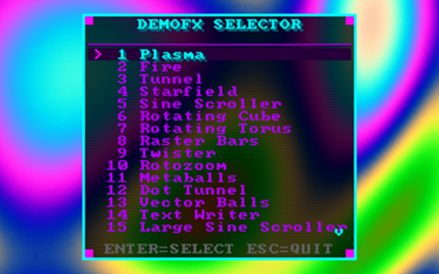

# Old School Demo Effects

Classic demoscene effects written in C using SDL2, running at the authentic 320x200 resolution.



> A collection of 27 old-school demo scene effects reminiscent of the Amiga/DOS era, featuring plasma waves, 3D graphics, particle systems, and more!

## Effects Included

1. **Plasma** - Animated colorful plasma waves using sine/cosine patterns
2. **Fire** - Classic rising fire effect with realistic flame propagation
3. **Tunnel** - 3D textured tunnel effect with precalculated lookup tables
4. **Starfield** - 3D starfield simulation with depth-based brightness
5. **Sine Scroller** - Horizontal text scroller with sine wave distortion
6. **Rotating Cube** - 3D wireframe cube with rotation on all axes
7. **Rotating Torus** - 3D filled torus with flat shading and lighting
8. **Raster Bars** - Classic Amiga-style colored bars with sine movement
9. **Twister** - Vertical column twist effect with animated texture rotation
10. **Rotozoom** - Rotating and zooming textured plane with checkerboard pattern
11. **Metaballs** - Organic blob effect with distance field calculations
12. **Dot Tunnel** - 3D tunnel made of individual colored dots with depth-based sizing
13. **Vector Balls** - 3D rotating sphere made of 600 colored dots with perspective projection
14. **Text Writer** - Animated typewriter text effect
15. **Large Sine Scroller** - Large-format sine wave text scroller
16. **3D Metaballs** - Three-dimensional metaballs with volumetric rendering
17. **Water Ripples** - Interactive water ripple simulation
18. **Voxel Landscape** - Height-mapped voxel terrain renderer
19. **Bump Mapping** - Real-time bump mapping effect
20. **Kaleidoscope** - Symmetrical kaleidoscope pattern generator
21. **Raytracer** - Real-time software raytracer with spheres
22. **Sierpinski Pyramid** - 3D fractal Sierpinski tetrahedron
23. **Particle Explosions** - Dynamic particle system with explosions
24. **4D Tesseract** - Four-dimensional hypercube projection
25. **Matrix Rain** - Classic Matrix-style falling characters
26. **Matrix Code Rain** - Enhanced Matrix code rain effect
27. **Lens Effect** - Magnification lens distortion effect

## Features

- **Optional Chiptune Music** - Enable procedural music synthesis with `--music` flag

## Requirements

- GCC compiler
- SDL2 development libraries
- Linux/Unix environment (or WSL on Windows)

### Installing SDL2

**Ubuntu/Debian:**
```bash
sudo apt-get install libsdl2-dev
```

**Fedora:**
```bash
sudo dnf install SDL2-devel
```

**Arch Linux:**
```bash
sudo pacman -S sdl2
```

**macOS (with Homebrew):**
```bash
brew install sdl2
```

## Building

Simply run:
```bash
make
```

To clean build artifacts:
```bash
make clean
```

To rebuild from scratch:
```bash
make rebuild
```

## Running

```bash
./build/demofx
```

Or build and run in one step:
```bash
make run
```

### Options

- `--music` - Enable background music (chip-tune synthesizer)
- `--help` - Show help message

## Controls

- **UP/DOWN** - Navigate through the effect menu
- **ENTER/SPACE** - Launch the selected effect
- **LEFT/RIGHT arrows** - switch between effects
- **T** - Change transition type
- **ESC** - Return to menu (or quit from menu)
- **ALT+ENTER** - Toggle fullscreen mode
- **F12** - Save a screenshot (saved to `screenshots/` directory)

## Technical Details

- **Resolution:** 320x200 (classic Mode 13h), scaled 3x for modern displays
- **Frame rate:** Capped at ~60 FPS
- **Rendering:** Software pixel buffer rendered to SDL2 texture
- **Optimization:** Precalculated lookup tables for sine/cosine and tunnel mapping

## Customization

You can easily modify the effects:

- **Resolution:** Change `SCREEN_WIDTH` and `SCREEN_HEIGHT` in common.h:1
- **Window scale:** Adjust `SCALE_FACTOR` in common.h:1
- **Colors:** Modify palette generation in each effect's `*_init()` function
- **Speed:** Adjust time divisors in each effect's `*_update()` function

## License

Free to use for learning and experimentation. Have fun!
